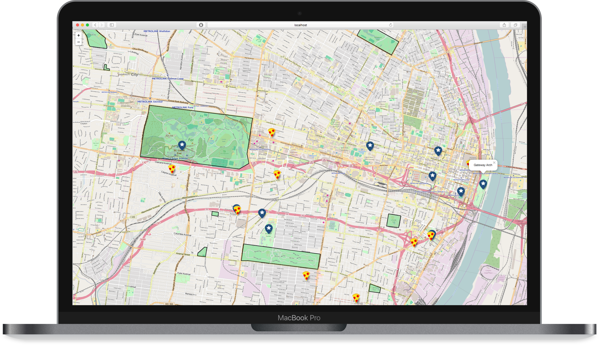

# GeoPackage To Go: Offline Maps from Web to Mobile
## FOSS4G North America 2018 - St. Louis, MO

A browser based GeoPackage example using [GeoPackage JS](https://github.com/ngageoint/geopackage-js) from the session at [FOSS4G](https://2018.foss4g-na.org/session/geopackage-go-offline-maps-web-mobile). There are also examples for [iOS](https://github.com/ngageoint/geopackage-ios/tree/master/docs/examples/swift/GeoPackage-to-go-iOS) and [Android](https://github.com/ngageoint/geopackage-android-map/tree/master/docs/examples/kotlin/GeoPackageToGoAndroid).


Map tiles from [OpenStreetMap](https://www.openstreetmap.org/).

This example page opens a GeoPackage with local landmarks, pizza restaurants, vectors of the parks, and OpenStreetMap tiles from St. Louis and displays them on a Leaflet map.

### Run

You can run this example using any web server. For simplicity, I prefer to use the Python module SimpleHTTPServer. If you have python installed, then you already have this module as well.

From this directory, run:

```
$ python -m SimpleHTTPServer
```

Open a web browser and point it to http://localhost:8000.

### Code Walkthrough

We are using Leaflet, but you could use any map you like.

In your HTML, you can include GeoPackage JS from unpkg.

```html
<script type="text/javascript" src="https://unpkg.com/@ngageoint/geopackage/dist/geopackage.min.js"></script>
```

For a full end to end example, please see index.js in this directory. Once you have your file loaded, you can access the tiles inside like so:

```javascript
var GeoPackageAPI = window.geopackage;

...

GeoPackageAPI.openGeoPackageByteArray(array, function(err, geoPackage) { // Now you can operate on the GeoPackage
  // Get the tile table names
  geoPackage.getTileTables(function(err, tileTableNames) {
    geoPackage.getTileDaoWithTableName(tileTableNames[0], function(err, tileDao) { // We know we have one tile layer, loop if you have more.
    var maxZoom = tileDao.maxWebMapZoom;
    var minZoom = tileDao.minWebMapZoom;
    var tableLayer = new L.GridLayer({noWrap: true, minZoom: minZoom, maxZoom: maxZoom});
    tableLayer.createTile = function(tilePoint, done) {
      var canvas = L.DomUtil.create('canvas', 'leaflet-tile');
      var size = this.getTileSize();
      canvas.width = size.x;
      canvas.height = size.y;
      setTimeout(function() {
        console.time('Draw tile ' + tilePoint.x + ', ' + tilePoint.y + ' zoom: ' + tilePoint.z);
        GeoPackageAPI.drawXYZTileInCanvas(geoPackage, tileTableNames[0], tilePoint.x, tilePoint.y, tilePoint.z, size.x, size.y, canvas, function(err) {
          console.timeEnd('Draw tile ' + tilePoint.x + ', ' + tilePoint.y + ' zoom: ' + tilePoint.z);
          done(err, canvas);
        });
      }, 0);
      return canvas;
    }
    geopackageMap.addLayer(tableLayer);
    tableLayer.bringToFront();
    });
  });

```

Now for the features. We need to pull the features out of the tables and convert them into a format that Leaflet can use display them on the map, in this case GeoJSON.

```javascript
geoPackage.getFeatureTables(function(err, featureTableNames) {
  for (var i = 0; i < featureTableNames.length; i++) {
    geoPackage.getFeatureDaoWithTableName(featureTableNames[i], function(err, featureDao) {
      geoPackage.getInfoForTable(featureDao, function(err, info) {

        // query for all features
        featureDao.queryForEach(function(err, row, rowDone) {
          var feature = featureDao.getFeatureRow(row);
          var geometry = feature.getGeometry();
          if (geometry) {
            // Make the information into something we can display on the map with leaflet
            var geom = geometry.geometry;
            var geoJson = geometry.geometry.toGeoJSON();
            geoJson.properties = {};
            geoJson.properties["table_name"] = feature.featureTable.table_name;

            // map the values from the feature table into GeoJSON properties we can use to style the map and show a popup
            for (var key in feature.values) {
              if(feature.values.hasOwnProperty(key) && key != feature.getGeometryColumn().name) {
                var column = info.columnMap[key];
                geoJson.properties[column.displayName] = feature.values[key];
              }
            }
            geojsonLayer.addData(geoJson);
          }
          rowDone();
        });
      });
    });
  }
});
```
